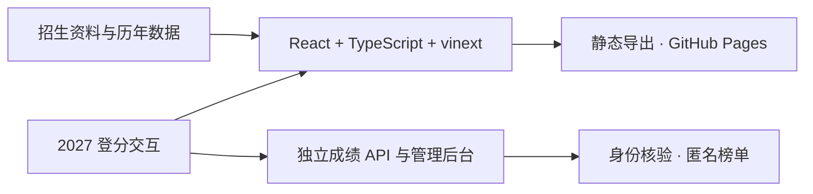

<p align="center">
  
</p>

<h1 align="center">沈计指南</h1>

<p align="center">
  中国科学院沈阳计算技术研究所报考信息整理站
  <br />
  把分散的招生、初试、复试与录取信息，整理成一张可以逐项核对的报考路线图。
</p>

<p align="center">
  <a href="https://sict.cskaoyan.cn/"></a>
  <a href="https://github.com/ucas-cskaoyan-web/sict-web/actions/workflows/pages.yml"></a>
  <a href="https://creativecommons.org/licenses/by-nc-sa/4.0/deed.zh-hans"></a>
</p>

<p align="center">
  <a href="https://sict.cskaoyan.cn/">报考指南</a> ·
  <a href="https://sict.cskaoyan.cn/data/">历年数据</a> ·
  <a href="https://sict.cskaoyan.cn/score/">2027 登分</a> ·
  <a href="https://sict.cskaoyan.cn/experiences/">经验归档</a> ·
  <a href="https://sict.cskaoyan.cn/sources/">来源说明</a>
</p>


## 关于本站

沈计指南是由学生整理和维护的公益信息项目。我们希望把散落在招生文件、录取名单、往届报告和个人经验中的内容，转成结构清晰、能够直接在线阅读的报考资料。

> [!IMPORTANT]
> 本站不是中国科学院沈阳计算技术研究所官方网站，也不代表研究所立场。招生专业、考试科目、名额与复试安排均可能变化，请始终以当年官方通知为准。

## 从这里开始

| 入口 | 主要内容 | 直达 |
| --- | --- | :---: |
| 报考指南 | 招生专业、初试科目、复试流程、成绩计算、培养地点、住宿与补助 | [开始阅读](https://sict.cskaoyan.cn/) |
| 历年数据 | 2024—2026 年复试与录取数据、分数段、学习方式和毕业去向 | [查看档案](https://sict.cskaoyan.cn/data/) |
| 经验归档 | 24 篇初试、复试、回忆题与备考经验，均已整理为站内文章 | [浏览文章](https://sict.cskaoyan.cn/experiences/) |
| 2027 登分 | QQ 登录、成绩证明核验、匿名统计，以及学硕与专硕独立排名 | [进入系统](https://sict.cskaoyan.cn/score/) |
| 来源说明 | 公开信息、学生整理材料和个人经验的分层口径 | [核对来源](https://sict.cskaoyan.cn/sources/) |
| 免责声明 | 非官方性质、内容边界、版权与勘误方式 | [完整说明](https://sict.cskaoyan.cn/disclaimer/) |

## 项目特点

- **网页优先**：核心报告与经验文章直接在线阅读，不要求下载原始文件。
- **完整口径**：尽量保留统计范围、缺失项与特殊计划，不用单个最低分代替完整分布。
- **边界清晰**：个人经验不等同于官方规则，历史数据也不能直接预测下一年度结果。
- **公益开放**：不设置付费内容，不接受商业推广，欢迎通过 Issue 或 Pull Request 参与勘误。

## 登分系统与隐私边界

2027 登分是与资料站分离的动态业务：考生使用 QQ 登录，填写四科成绩并上传研招网成绩证明；记录经人工核验后，才会进入公开榜单。

- 学术型硕士与专业型硕士分别统计、独立排名，同分并列。
- 公开页面只展示各科分数、总分和名次，不公开姓名、学校、准考证号、QQ 信息或成绩证明。
- 姓名、学校、准考证号与联系邮箱以**明文**保存在后端，仅供管理后台核验和去重；“仅后台可见”不代表加密存储。
- 登分来自考生自愿提交，样本不完整，不代表官方排名、复试线或录取结果。

## 技术架构



| 层级 | 实现 |
| --- | --- |
| 页面 | React 19、TypeScript、原生 CSS |
| 构建 | vinext、Vite、静态导出 |
| 发布 | GitHub Actions、GitHub Pages、自定义域名 |
| 动态业务 | 独立成绩 API 与管理后台，本仓库只包含公开前端 |
| 质量检查 | Node.js 渲染测试、ESLint |

这种分层让报考指南、数据报告和经验文章保持低维护、可静态访问，同时避免让整个内容站依赖数据库和业务后端。

## 本地开发

需要 [Node.js](https://nodejs.org/) 22.13 或更高版本。

```bash
git clone https://github.com/ucas-cskaoyan-web/sict-web.git
cd sict-web
npm ci
cp .env.example .env.local
npm run dev
```

如需联调登分系统，请在 `.env.local` 中填写公开的 QQ 互联 AppID、回调地址与成绩 API 地址。不要把 QQ AppKey 或其他服务端密钥放入前端环境变量。

| 命令 | 用途 |
| --- | --- |
| `npm run dev` | 启动本地开发环境 |
| `npm run build` | 构建站点 |
| `npm test` | 构建并运行服务端渲染测试 |
| `npm run lint` | 运行代码规范检查 |
| `npm run pages:build` | 生成 GitHub Pages 静态产物 |

## 参与贡献

发现数据、文字或链接有误时，欢迎[提交 Issue](https://github.com/ucas-cskaoyan-web/sict-web/issues)；如果你已经完成修正，也可以直接发起 Pull Request。

提交资料或数据更正时，请尽量附上：

1. 对应年份与页面位置；
2. 可公开核对的来源；
3. 统计范围、缺失项或特殊口径；
4. 建议修改后的准确表述。

## 数据与版权

数据来自项目资料中的学生整理报告、录取统计表、报考指南以及公开招生信息。公开页面不提供 PDF、Word、Excel 等原始材料下载。

除另有说明的第三方材料外，本站原创整理内容采用 [CC BY-NC-SA 4.0](https://creativecommons.org/licenses/by-nc-sa/4.0/deed.zh-hans) 许可；经验原文的权利仍归原作者所有。完整边界见网站[免责声明](https://sict.cskaoyan.cn/disclaimer/)。

## 致谢

项目的信息组织与公益维护方式参考了：

- [中科院软件所报考指南](https://iscas.cskaoyan.cn/)
- [中科院信工所考研信息站](https://iie.cskaoyan.cn/)

感谢历年整理数据、分享经验、参与勘误，以及为后来者留下资料的每一位同学。
