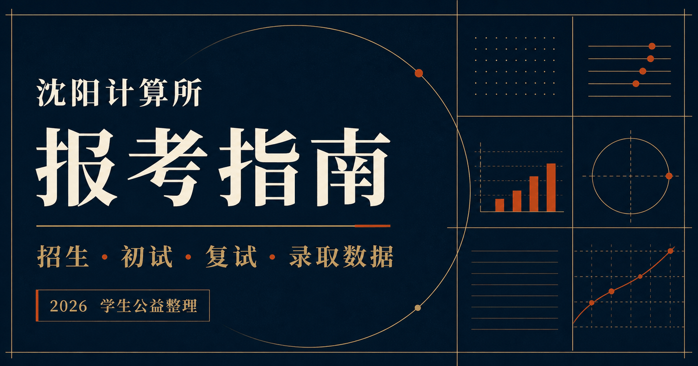

# 沈计指南

> 中国科学院沈阳计算技术研究所报考信息整理站

[在线访问](https://huazhao-nine.github.io/sict-web/) · [历年数据](https://huazhao-nine.github.io/sict-web/data/) · [经验归档](https://huazhao-nine.github.io/sict-web/experiences/) · [免责声明](https://huazhao-nine.github.io/sict-web/disclaimer/)

## 项目简介

沈计指南是由学生整理和维护的公益信息项目，希望把散落在招生文件、录取名单、往届报告和个人经验中的内容，转成结构清晰、可以直接在网页阅读的报考指南。

本站不是中国科学院沈阳计算技术研究所官方网站，也不代表研究所立场。招生专业、考试科目、名额和复试安排均可能变化，请始终以当年官方通知为准。

## 收录内容

- **报考指南**：招生专业、初试科目、复试流程、成绩计算、培养地点、住宿与补助。
- **历年数据**：2024—2026 年录取数据，以及 2026 年复试、录取、分数段和毕业去向报告。
- **经验归档**：24 篇初试、复试、回忆题与备考经验，全部整理为站内文章。
- **来源说明**：公开信息、学生整理材料和个人经验的分层口径。
- **交流与反馈**：2027 中科院沈计所考研交流群、内容勘误与资料补充入口。

## 整理原则

1. **网页优先**：核心报告和经验文章直接在线阅读，不要求下载原文件。
2. **标明边界**：个人经验不等同于官方规则，历史数据不能直接预测下一年度结果。
3. **保留口径**：说明统计范围、缺失项和特殊计划，避免用单个最低分代替完整分布。
4. **公益开放**：不设置付费内容，不接受商业推广，欢迎通过 Issue 或 Pull Request 参与勘误。

## 数据与版权

数据来自项目资料中的学生整理报告、录取统计表、报考指南以及公开招生信息。公开页面不提供 PDF、Word、Excel 等原始材料下载。

除另有说明的第三方材料外，本站原创整理内容采用 [CC BY-NC-SA 4.0](https://creativecommons.org/licenses/by-nc-sa/4.0/deed.zh-hans) 许可；经验原文的权利仍归原作者所有。完整边界见网站[免责声明](https://huazhao-nine.github.io/sict-web/disclaimer/)。

## 致谢

项目的信息组织与公益维护方式参考了：

- [中科院软件所报考指南](https://iscas.cskaoyan.cn/)
- [中科院信工所考研信息站](https://iie.cskaoyan.cn/)

感谢历年整理数据、分享经验、参与勘误和为后来者留下资料的同学。
